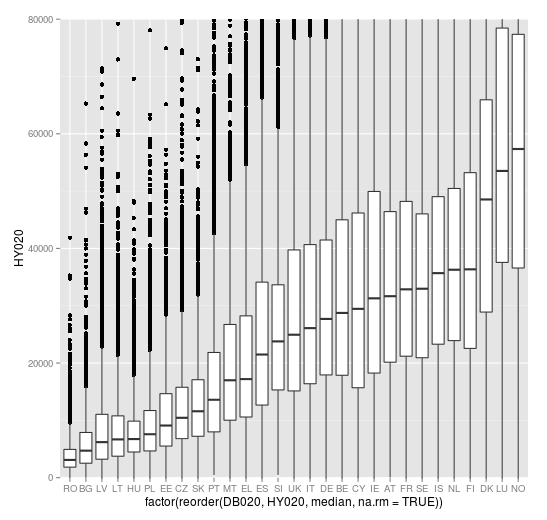
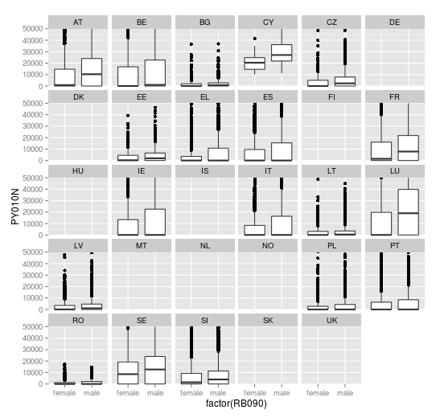
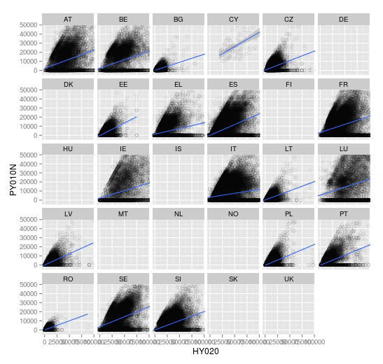
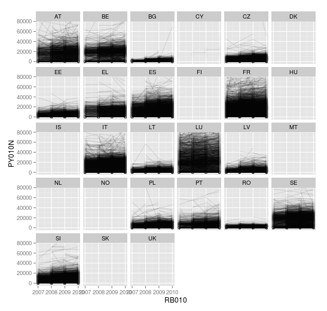
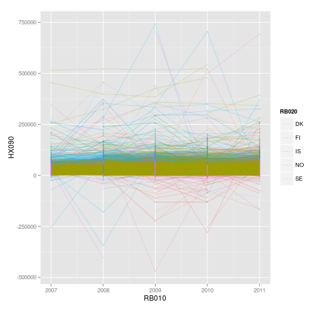

```{r rundoc, eval=FALSE, include=FALSE}
rmarkdown::render(input = "/home/aurelius/btsync/mk/workspace/paketit/r.eusilc/vignettes/r.eusilc_tutorial.Rmd", output_file = "/home/aurelius/btsync/mk/workspace/paketit/r.eusilc/vignettes/r.eusilc_tutorial.html")
```


# Data documentation

Perhaps the most compherensive documentation of EU-SILC data is by [GESIS](http://www.gesis.org/home/)

## Variable level documentaion 


- All [pdf-codebooks](http://www.gesis.org/en/missy/materials/EU-SILC/documents/codebooks)

### Documentation for web browser - click the year 

|   Cross-sectional data                                                               | Panel data                                                                 |
|   ---------------------------------------------------------------------------------  | -------------------------------------------------------------------------- |
| [2013](http://www.gesis.org/en/missy/metadata/EU-SILC/2013/Cross-sectional/original) | [2013](http://www.gesis.org/en/missy/metadata/EU-SILC/2013/Panel/original) |
| [2012](http://www.gesis.org/en/missy/metadata/EU-SILC/2012/Cross-sectional/original) | [2012](http://www.gesis.org/en/missy/metadata/EU-SILC/2012/Panel/original) |
| [2011](http://www.gesis.org/en/missy/metadata/EU-SILC/2011/Cross-sectional/original) | [2011](http://www.gesis.org/en/missy/metadata/EU-SILC/2011/Panel/original) |
| [2010](http://www.gesis.org/en/missy/metadata/EU-SILC/2010/Cross-sectional/original) | [2010](http://www.gesis.org/en/missy/metadata/EU-SILC/2010/Panel/original) |
| [2009](http://www.gesis.org/en/missy/metadata/EU-SILC/2009/Cross-sectional/original) | [2009](http://www.gesis.org/en/missy/metadata/EU-SILC/2009/Panel/original) |
| [2008](http://www.gesis.org/en/missy/metadata/EU-SILC/2008/Cross-sectional/original) | [2008](http://www.gesis.org/en/missy/metadata/EU-SILC/2008/Panel/original) |
| [2007](http://www.gesis.org/en/missy/metadata/EU-SILC/2007/Cross-sectional/original) | [2007](http://www.gesis.org/en/missy/metadata/EU-SILC/2007/Panel/original) |
| [2006](http://www.gesis.org/en/missy/metadata/EU-SILC/2006/Cross-sectional/original) | 2006 |
| [2005](http://www.gesis.org/en/missy/metadata/EU-SILC/2005/Cross-sectional/original) | 2005 |


## Basic information of data and different waves

- [Variables over time](http://www.gesis.org/en/missy/matrix/variables/EU-SILC)
- [Dataset availability over time & countries: EU-SILC](http://www.gesis.org/en/missy/matrix/datasets/EU-SILC)
<<<<<<< HEAD
- [Variables-by-Year-Matrix-2004-2013](http://www.etracker.de/lnkcnt.phpäet=qPKGYV&url=http://www.gesis.org/fileadmin/upload/dienstleistung/daten/amtl_mikrodaten/europ_microdata/EU-SILC/Tools/variables_by_year_2004_2013.xlsx&lnkname=fileadmin/upload/dienstleistung/daten/amtl_mikrodaten/europ_microdata/EU-SILC/Tools/variables_by_year_2004_2013.xlsx) (Excel-file) - 
=======
- [Variables-by-Year-Matrix-2004-2013](http://www.etracker.de/lnkcnt.phpäet=qPKGYV&url=http://www.gesis.org/fileadmin/upload/dienstleistung/daten/amtl_mikrodaten/europ_microdata/EU-SILC/Tools/variables_by_year_2004_2013.xlsx&lnkname=fileadmin/upload/dienstleistung/daten/amtl_mikrodaten/europ_microdata/EU-SILC/Tools/variables_by_year_2004_2013.xlsx) (Excel-tiedosto) - 
>>>>>>> c3f354a7b3a7e83bf82a23c65b17ae472086e6b4
(incl. variables, type of data, reference period, unit of observation, mode of collection)

## Misc documentation

- [quality reports](http://www.gesis.org/en/missy/materials/EU-SILC/documents/quality-reports)
- [Data Handling & Analysis: EU-SILC](http://www.gesis.org/en/missy/materials/EU-SILC/tools/datahandling)
- [Training materials](http://www.gesis.org/en/missy/materials/EU-SILC/tools/training)
- [Routines to transform *.csv to SPSS/Stata system files](http://www.gesis.org/en/missy/materials/EU-SILC/setups)


# Merging EU-SILC raw data using r.eusilc-package


This tutorial will go through a process for merging EU-SILC raw .csv data files using [r.eusilc](https://github.com/muuankarski/r.eusilc)-package and creating an analysis ready-dataset. Tutorial will explain five different scenarios for creating datasets:

1. Household level dataset from cross-sectional data
2. Individual level dataset from cross-sectional data
3. Individual level dataset with household level variables from cross-sectional data
4. Individual level dataset with household level variables from longitudinal data
5. Pooled individual level dataset with household level variables from longitudinal data

All the analysis are implemented in R, but the output data can be formatted also for proprietary software, like *SPSS*, *SAS* or *Stata*.

This demo will use data from 2010, but in the 5th example will pool it with data from 2009. 


Preparations
===============================


**Requirements:**

- >=8 GB of RAM
- time. The third example takes about 15 minutes to run on my computer 

Eu-silc datasets are delivered on a laser disc, where you have on each disc a four .csv files representing one either *cross-sectional* or *longitudinal* version of data. Raw .csv-files are named as `UDB_L06D_ver 2006-2 from 01-03-2009`, that in this case would mean:

- user database
- longitudinal
- d-file (household register)
- from year 2006 revision 2
- published year 2009

Specifying the paths or original .csv files
-------------------------------

You have to specify path to each of the four original .csv files for the following parameters:

    path.personal.register
    path.personal.data
    path.household.register
    path.household.data

Consider structuring your raw data archive into something like (this is how my data is organised for this demo):

```{r , eval=FALSE}

demo_data
|\
| \-eusilc_raw
|    |-----2010
|    |      |---longi_rev3
|    |      |    |-------- UDB_l10R_ver 2010-4 from 01-03-2014.csv
|    |      |    |-------- UDB_l10P_ver 2010-4 from 01-03-2014.csv
|    |      |    |-------- UDB_l10D_ver 2010-4 from 01-03-2014.csv
|    |      |    |-------- UDB_l10H_ver 2010-4 from 01-03-2014.csv
|    |      |---cross_rev4
|    |      |    |-------- UDB_c10R_ver 2010-5 from 01-03-14.csv
|    |      |    |-------- UDB_c10P_ver 2010-5 from 01-03-14.csv
|    |      |    |-------- UDB_c10D_ver 2010-5 from 01-03-14.csv
|____|______|____|-------- UDB_c10H_ver 2010-5 from 01-03-14.csv
|    |-----2011
|    |      |---longi_rev1
|    |      |    |-------- UDB_l11R_ver 2011-2 from 01-03-2014.csv
|    |      |    |-------- UDB_l11P_ver 2011-2 from 01-03-2014.csv
|    |      |    |-------- UDB_l11D_ver 2011-2 from 01-03-2014.csv
|____|______|____|-------- UDB_l11H_ver 2011-2 from 01-03-2014.csv
|    |      |---cross_rev2
|    |      |    |-------- UDB_c11R_ver 2012-3 from 01-03-14.csv
|    |      |    |-------- UDB_c11P_ver 2012-3 from 01-03-14.csv
|    |      |    |-------- UDB_c11D_ver 2012-3 from 01-03-14.csv
|____|______|____|-------- UDB_c11H_ver 2012-3 from 01-03-14.csv
|    |-----2012
|    |      |---cross_rev0
|    |      |    |-------- UDB_c12R_ver 2012-1 from 01-03-14.csv
|    |      |    |-------- UDB_c12P_ver 2012-1 from 01-03-14.csv
|    |      |    |-------- UDB_c12D_ver 2012-1 from 01-03-14.csv
|____|______|____|-------- UDB_c12H_ver 2012-1 from 01-03-14.csv
|\
| \-eusilc_merged
|    |---2010
|    |     |----- 
|    |     |----- 
|    |---2011
|    |     |----- 
|____|_____|----- 


```


Installing r.eusilc-package
-------------------------------

For installation you need to have **devtools**-package installed with  `install.packages("devtools")`. In Windows you will need [RTools](http://cran.r-project.org/bin/windows/Rtools/index.html) to be installed before installing **devtools**-package.


```{r , eval=FALSE}
library(devtools)
install_github("muuankarski/r.eusilc")
library(r.eusilc)
```

There is only one function `merge_eusilc()` in the package. Typing `?merge_eusilc` will print you the help file.

Examples
=============================================


Household level dataset from cross-sectional data
---------------------------------------------

Here we are merging the household register file with household data file. Function reads the raw -csv files in `~/data_demo/eusilc_raw/2010/cross_rev4`and writes the merged output in `csv` format in `~/data_demo/eusilc_merged/2010` with filename `2010hh_merge_cross.csv`. In addition, function returns `data.frame` object `hh_cross_2010` in the R session.

```{r case1data, eval=FALSE}
library(r.eusilc)
hh_cross_2011 <- merge_eusilc(path.household.register = "~/demo_data/eusilc_raw/2011/cross_rev2/UDB_c11D_ver 2011-3 from 01-03-14.csv",
                              path.household.data     = "~/demo_data/eusilc_raw/2011/cross_rev2/UDB_c11H_ver 2011-3 from 01-03-14.csv",
                              output.path="~/demo_data/eusilc_merged/2011",
                              level="household",
                              format="csv",
                              output.filename = "hh_cross_2011",
                              subset.vars.per.reg="all",
                              subset.vars.per.data="all",
                              subset.vars.hh.reg="all",
                              subset.vars.hh.data="all",
                              subset.countries="all") 
```

You can create a boxplot on *total disposable household income* [`HY020`](http://www.gesis.org/?id=2649#HY020) by country [`DB020`](http://www.gesis.org/?id=2634#DB020) with following code:

```{r case1plot,  eval=FALSE}
library(ggplot2)
ggplot(hh_cross_2010, aes(x=factor(reorder(DB020, HY020, median, na.rm=TRUE)), y=HY020)) + 
  geom_boxplot() + 
  coord_cartesian(ylim=c(0,80000))
```



Individual level dataset from cross-sectional data
---------------------------------------------

Here we are merging the personal register file with personal data file. Function reads the raw -csv files in `~/data_demo/eusilc_raw/2010/cross_rev4`and writes the merged output in `csv` format in `~/data_demo/eusilc_merged/2010` with filename `2010per_merge_cross.csv`. In addition, function returns `data.frame` object `per_cross_2010` in the R session.

```{r case2data,  warning=FALSE, message=FALSE, eval=FALSE}
library(r.eusilc)
per_cross_2011 <- merge_eusilc(path.personal.register  = "~/demo_data/eusilc_raw/2011/cross_rev2/UDB_c11R_ver 2011-3 from 01-03-14.csv",
                               path.personal.data      = "~/demo_data/eusilc_raw/2011/cross_rev2/UDB_c11P_ver 2011-3 from 01-03-14.csv",
                              output.path="~/demo_data/eusilc_merged/2011",
                              output.filename = "per_cross_2011",
                              format="RDS",
                              level="personal",
                              subset.vars.per.reg="all",
                              subset.vars.per.data="all",
                              subset.vars.hh.reg="all",
                              subset.vars.hh.data="all",
                              subset.countries="all") 
```

You can create a boxplot on *Employee cash or near cash income(net)* [`PY010N`](http://www.gesis.org/?id=2643#PY010N) by sex [`RB090`](http://www.gesis.org/?id=2639#RB090) and country [`RB020`](http://www.gesis.org/?id=2639#RB020) with following code:

```{r case2plot,  warning=FALSE, message=FALSE, eval=FALSE}
# removing NA values from sex-variable
plot_data <- per_cross_2010[!is.na(per_cross_2010$RB090),]
# relevelling the sex-variable
plot_data$RB090[plot_data$RB090 == 1] <- "male"
plot_data$RB090[plot_data$RB090 == 2] <- "female"

library(ggplot2)
ggplot(plot_data, aes(x=factor(RB090), y=PY010N)) +
  geom_boxplot() +
  coord_cartesian(ylim=c(0,50000)) +
  facet_wrap(~RB020)
```



Individual level dataset with household level variables from cross-sectional data
---------------------------------------------

Here we are merging the household register with household data files and then merging the merged household register and data files into it. Function reads the raw -csv files in `~/data_demo/eusilc_raw/2010/cross_rev4`and writes the merged output in `csv` format in `~/data_demo/eusilc_merged/2010` with filename `2010both_merge_cross.csv`. In addition, function returns `data.frame` object `both_cross_2010` in the R session.

```{r case3data,  warning=FALSE, message=FALSE, eval=FALSE}
library(r.eusilc)
both_cross_2011 <- merge_eusilc(path.personal.register  = "~/demo_data/eusilc_raw/2011/cross_rev2/UDB_c11R_ver 2011-3 from 01-03-14.csv",
                                path.personal.data      = "~/demo_data/eusilc_raw/2011/cross_rev2/UDB_c11P_ver 2011-3 from 01-03-14.csv",
                                path.household.register = "~/demo_data/eusilc_raw/2011/cross_rev2/UDB_c11D_ver 2011-3 from 01-03-14.csv",
                                path.household.data     = "~/demo_data/eusilc_raw/2011/cross_rev2/UDB_c11H_ver 2011-3 from 01-03-14.csv",
                                output.path="~/demo_data/eusilc_merged/2011",
                                output.filename = "both_cross_2011",
                                format="RDS",
                                level="both",
                                subset.vars.per.reg="all",
                                subset.vars.per.data="all",
                                subset.vars.hh.reg="all",
                                subset.vars.hh.data="all",
                                subset.countries="all") 
```

For this data we shall create a scatterplot where we have household level *total disposable household income* [`HY020`](http://www.gesis.org/?id=2649#HY020) on the x-axis and personal level *Employee cash or near cash income(net)* [`PY010N`](http://www.gesis.org/?id=2643#PY010N) on the y-axis. 


```{r case3plot,  warning=FALSE, message=FALSE, eval=FALSE}
library(ggplot2)
ggplot(both_cross_2010, aes(x=HY020, y=PY010N)) +
    geom_point(alpha=.1, shape=1) +
    geom_smooth(method=lm) +
    coord_cartesian(xlim=c(-5000,100000), ylim=c(-5000,50000)) +
    facet_wrap(~RB020)
```




Individual level dataset with household level variables from longitudinal data
---------------------------------------------

Here we are merging the personal register with personal data from longitudinal data. Function reads the raw -csv files in `~/data_demo/eusilc_raw/2010/longi_rev2`and writes the merged output in `csv` format in `~/data_demo/eusilc_merged/2010` with filename `2010per_merge_longi.csv`. In addition, function returns `data.frame` object `per_longi_2010` in the R session.

```{r case4data, eval=FALSE}
library(r.eusilc)
both_longi_2011 <- merge_eusilc(path.personal.register = "~/demo_data/eusilc_raw/2011/longi_rev1/UDB_l11R_ver 2011-2 from 01-03-2014.csv",
                               path.personal.data      = "~/demo_data/eusilc_raw/2011/longi_rev1/UDB_l11P_ver 2011-2 from 01-03-2014.csv",
                               path.household.register = "~/demo_data/eusilc_raw/2011/longi_rev1/UDB_l11D_ver 2011-2 from 01-03-2014.csv",
                               path.household.data     = "~/demo_data/eusilc_raw/2011/longi_rev1/UDB_l11H_ver 2011-2 from 01-03-2014.csv",
                               output.path="~/demo_data/eusilc_merged/2011",
                               level="both",
                               output.filename = "both_longi_2011",
                               format="RDS",
                               subset.vars.per.reg="all",
                               subset.vars.per.data="all",
                               subset.vars.hh.reg="all",
                               subset.vars.hh.data="all",
                               subset.countries="all") 
```


```{r case4plot,  warning=FALSE, message=FALSE, eval=FALSE}
# lets take sample of 500 000
plot_data <- per_longi_2010[sample(1:nrow(per_longi_2010), 500000,
   replace=FALSE),] 

library(ggplot2)
ggplot(plot_data, aes(x=RB010, y=PY010N, group=PER_ID)) +
    geom_point(alpha=.01, shape=1) + geom_line(alpha=.1) +
    coord_cartesian(ylim=c(-5000,80000)) +
    facet_wrap(~RB020)    
```



Pooled individual level dataset with household level variables from longitudinal data
---------------------------------------------

**Loading the datasets**

```{r case5data, eval=FALSE}
library(r.eusilc)
both_longi_2010 <- merge_eusilc(path.personal.register = "~/demo_data/eusilc_raw/2010/longi_rev3/UDB_l10R_ver 2010-4 from 01-03-2014.csv",
                               path.personal.data      = "~/demo_data/eusilc_raw/2010/longi_rev3/UDB_l10P_ver 2010-4 from 01-03-2014.csv",
                               path.household.register = "~/demo_data/eusilc_raw/2010/longi_rev3/UDB_l10D_ver 2010-4 from 01-03-2014.csv",
                               path.household.data     = "~/demo_data/eusilc_raw/2010/longi_rev3/UDB_l10H_ver 2010-4 from 01-03-2014.csv",
                               output.path="~/demo_data/eusilc_merged/2010",
                               output.filename = "both_longi_2010",
                               level="both",
                               format="RDS",
                               subset.vars.per.reg="all",
                               subset.vars.per.data="all",
                               subset.vars.hh.reg="all",
                               subset.vars.hh.data="all",
                               subset.countries="all") 

both_longi_2011 <- merge_eusilc(path.personal.register = "~/demo_data/eusilc_raw/2011/longi_rev1/UDB_l11R_ver 2011-2 from 01-03-2014.csv",
                               path.personal.data      = "~/demo_data/eusilc_raw/2011/longi_rev1/UDB_l11P_ver 2011-2 from 01-03-2014.csv",
                               path.household.register = "~/demo_data/eusilc_raw/2011/longi_rev1/UDB_l11D_ver 2011-2 from 01-03-2014.csv",
                               path.household.data     = "~/demo_data/eusilc_raw/2011/longi_rev1/UDB_l11H_ver 2011-2 from 01-03-2014.csv",
                               output.path="~/demo_data/eusilc_merged/2011",
                               level="both",
                               output.filename = "both_longi_2011",
                               format="RDS",
                               subset.vars.per.reg="all",
                               subset.vars.per.data="all",
                               subset.vars.hh.reg="all",
                               subset.vars.hh.data="all",
                               subset.countries="all") 
```


### Selecting identical variables & only Nordic countries from both datasets


```{r , eval=FALSE}
vars.per.reg <- c("RB010", # Year
                  "RB020", # Country
                  "RB030", # Personal ID
                  "RB080", # Year of birth
                  "RB090", # Sex
                  "RX010") # Age at the date of the interview

## Personal register data - 2008 oma lista (PL030 case)
vars.per.data <- c("PB190", # Marital status
                   "PB200", # Consensual union
                   "PL031", # Self-defined current economic status
                   "PL040") # Status in employment
                                        

## Household register
vars.hh.reg <- c("DB110") # Household status

## Household data
vars.hh.data <- c("HY010", # Total Household Gross Income
                  "HY020", # total disposable household income
                  "HY022", # Total Transposable Household Income before social transfers other than old-age and survivors benefits
                  "HY023", # Total disposable Household income before social transfers including old-age and survivors benefits
                  "HX040", # Household size
                  "HX050", # Equivalent household size
                  "HX090") # Equivalized disposable household income

subset.vars <- c(vars.per.reg,vars.per.data,
                 vars.hh.reg,vars.hh.data)
nordic.countries <- c("SE","NO","FI","DK","IS")


both_longi_2010 <- readRDS("~/demo_data/eusilc_merged/2010/both_longi_2010.RDS")
both_longi_2011 <- readRDS("~/demo_data/eusilc_merged/2011/both_longi_2011.RDS")
# subsetting
suse_2010 <- both_longi_2010[both_longi_2010$RB020 %in% nordic.countries,
                             subset.vars]
suse_2011 <- both_longi_2011[both_longi_2011$RB020 %in% nordic.countries,
                             subset.vars]
```


### Row binding the datasets & removing duplicates

Now we have identical variables for both datasets and it is easy to combine them using `rbind`.

As we have duplicate information from certain individual from certain year from different datas (person x information from year 2009 is in BOTH 2010 and 2011 londitudinal data), we have to remove them and only leave the first occasion of that information.

```{r , eval=FALSE}
dat <- rbind(suse_2010,
             suse_2011)
#
dat <- dat[!duplicated(dat[c("RB010", # Year
                             "RB020", # country
                             "RB030")]),] # personal ID
```

By removing the duplicates we are left with 268522 individuals and we can plor their household income across the years by with following code

```{r , eval=FALSE}
library(ggplot2)
ggplot(data=dat, 
       aes(x=RB010,
       y=HX090,
       color=RB020,
       group=RB030)) +
  geom_path(alpha=.1) + 
  geom_point(alpha=.1, size=1)

```


