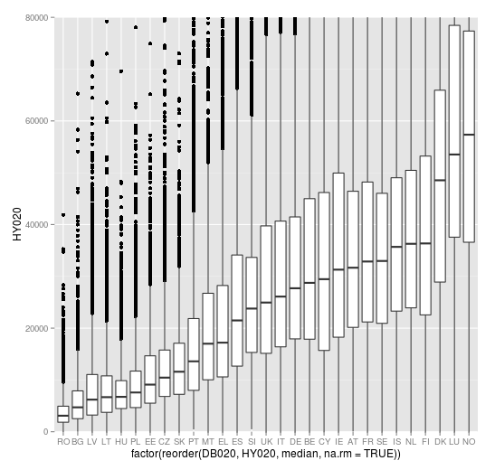
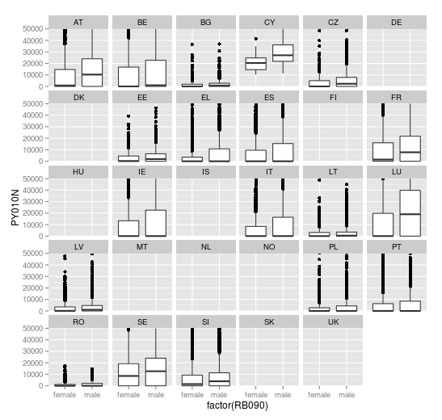

<!--
%\VignetteEngine{knitr::knitr}
%\VignetteIndexEntry{r.eusilc Markdown Vignette made with knitr}
-->
---
title: Merging EU-SILC raw data using r.eusilc-package
author: Markus Kainu
date: February 26, 2014
...

Introduction
===============================

This tutorial will go through a process for merging EU-SILC raw .csv data files using [r.eusilc](https://github.com/muuankarski/r.eusilc)-package and creating an analysis ready dataset. Tutorial will explain five different scenarios for creating datasets:

1. Household level dataset from cross-sectional data
2. Individual level dataset from cross-sectional data
3. Individual level dataset with household level variables from cross-sectional data
4. Individual level dataset with household level variables from longitudinal data
5. Pooled individual level dataset with household level variables from longitudinal data

All the analysis are implemented in R, but the output data can be formatted also for proprietary software, like *SPSS*, *SAS* or *Stata*.

This demo will use data from 2010, but in the 5th example will pool it with data from 2009. 


Preparations
===============================


**Requirements:**

- 16 GB of RAM
- original files in r_file.csv, p_file.csv.. format in origin.path -folder
- time. The third example takes about 15 minutes to run on my computer 

Eu-silc datasets are delivered on a laser disc, where you have on each disc a four .csv files representing one either *cross-sectional* or *longitudinal* version of data. Raw .csv-files are named as `UDB_L06D_ver 2006-2 from 01-03-2009`, that in this case would mean:

- user database
- longitudinal
- d-file (household register)
- from year 2006 revision 2
- published year 2009

Renaming the original files
-------------------------------

In order to follow this tutorial you will have to rename the .csv files following the example below:

- `UDB_L06R_ver 2006-2 from 01-03-2009.csv` =>> `r_file.csv`
- `UDB_L06P_ver 2006-2 from 01-03-2009.csv` =>> `p_file.csv`
- `UDB_L06D_ver 2006-2 from 01-03-2009.csv` =>> `d_file.csv`
- `UDB_L06H_ver 2006-2 from 01-03-2009.csv` =>> `h_file.csv`

In addition to renaming you should also consider structuring your raw data archive into something like (this is how my data is organised for this demo):


```r

demo_data
|\
| \-eusilc_raw
|    |-----2009
|    |      |---longi_rev2
|    |      |    |-------- r_file.csv
|    |      |    |-------- p_file.csv
|    |      |    |-------- d_file.csv
|    |      |    |-------- h_file.csv
|    |      |---cross_rev4
|    |      |    |-------- r_file.csv
|    |      |    |-------- p_file.csv
|    |      |    |-------- d_file.csv
|    |      |    |-------- h_file.csv
|    |-----2010
|    |      |---longi_rev2
|    |      |    |-------- r_file.csv
|    |      |    |-------- p_file.csv
|    |      |    |-------- d_file.csv
|    |      |    |-------- h_file.csv
|    |      |---cross_rev3
|    |      |    |-------- r_file.csv
|    |      |    |-------- p_file.csv
|    |      |    |-------- d_file.csv
|____|______|____|-------- h_file.csv
|\
| \-eusilc_merged
|    |---case1_individual_cross_sectional
|    |     |----- per_longi.csv
|    |     |----- hh_longi.csv
|    |     |----- hh_cross.csv
|    |     |----- hh_cross.csv
|    |---2010
|    |     |----- per_longi.csv
|    |     |----- hh_longi.csv
|    |     |----- hh_cross.csv
|____|_____|----- hh_cross.csv

```


Installing r.eusilc-package
-------------------------------

For installation you need to have **devtools**-package installed with  `install.packages("devtools")`. In Windows you will need [RTools](http://cran.r-project.org/bin/windows/Rtools/index.html) to be installed before installing **devtools**-package.


```r
library(devtools)
install_github("r.eusilc","muuankarski")
library(r.eusilc)
```


There is only one function `merge_eusilc()` in the package. Typing `?merge_eusilc` will print you the help file.

Examples
=============================================


Household level dataset from cross-sectional data
---------------------------------------------

Here we are merging the household register file with household data file. Function reads the raw -csv files in `~/data_demo/eusilc_raw/2010/cross_rev3`and writes the merged output in `csv` format in `~/data_demo/eusilc_merged/2010` with filename `2010hh_merge_cross.csv`. In addition, function returns `data.frame` object `hh_cross_2010` in the R session.


```r
library(r.eusilc)
hh_cross_2010 <- merge_eusilc(origin.path="~/demo_data/eusilc_raw/2010/cross_rev3",
                          output.path="~/demo_data/eusilc_merged/2010",
                          level="household",
                          type="cross-sectional",
                          year="2010",
                          format="csv",
                          subset.vars="all",
                          subset.countries="all") 
```


You can create a boxplot on *total disposable household income* [`HY020`](http://www.gesis.org/?id=2649#HY020) by country [`DB020`](http://www.gesis.org/?id=2634#DB020) with following code:


```r
library(ggplot2)
ggplot(hh_cross_2010, aes(x=factor(reorder(DB020, HY020, median, na.rm=TRUE)),
                          y=HY020)) +
    geom_boxplot() +
    coord_cartesian(ylim=c(0,80000))

```




2. Individual level dataset from cross-sectional data
---------------------------------------------

Here we are merging the personal register file with personal data file. Function reads the raw -csv files in `~/data_demo/eusilc_raw/2010/cross_rev3`and writes the merged output in `csv` format in `~/data_demo/eusilc_merged/2010` with filename `2010per_merge_cross.csv`. In addition, function returns `data.frame` object `per_cross_2010` in the R session.


```r
library(r.eusilc)
per_cross_2010 <- merge_eusilc(origin.path="~/demo_data/eusilc_raw/2010/cross_rev3",
                            output.path="~/demo_data/eusilc_merged/2010",
                            level="personal",
                            type="cross-sectional",
                            year="2010",
                            format="RData",
                            subset.vars="all",
                            subset.countries="all") 
```


You can create a boxplot on *Employee cash or near cash income(net)* [`PY010N`](http://www.gesis.org/?id=2643#PY010N) by sex [`RB090`](http://www.gesis.org/?id=2639#RB090) and country [`RB020`](http://www.gesis.org/?id=2639#RB020) with following code:


```r
# removing NA values from sex-variable
plot_data <- per_cross_2010[!is.na(per_cross_2010$RB090),]
# relevelling the sex-variable
plot_data$RB090[plot_data$RB090 == 1] <- "male"
plot_data$RB090[plot_data$RB090 == 2] <- "female"

library(ggplot2)
ggplot(plot_data, aes(x=factor(RB090),
                          y=PY010N)) +
    geom_boxplot() +
    coord_cartesian(ylim=c(0,50000)) +
    facet_wrap(~RB020)
```




3. Individual level dataset with household level variables from cross-sectional data
---------------------------------------------

Here we are merging the household register with household data files and then merging the merged household register and data files into it. Function reads the raw -csv files in `~/data_demo/eusilc_raw/2010/cross_rev3`and writes the merged output in `csv` format in `~/data_demo/eusilc_merged/2010` with filename `2010both_merge_cross.csv`. In addition, function returns `data.frame` object `both_cross_2010` in the R session.


```r
library(r.eusilc)
both_cross_2010 <- merge_eusilc(origin.path="~/demo_data/eusilc_raw/2010/cross_rev3",
                            output.path="~/demo_data/eusilc_merged/2010",
                            level="both",
                            type="cross-sectional",
                            year="2010",
                            format="RData",
                            subset.vars="all",
                            subset.countries="all") 
```


For this data we shall create a scatterplot where we have household level *total disposable household income* [`HY020`](http://www.gesis.org/?id=2649#HY020) on the x-axis and personal level *Employee cash or near cash income(net)* [`PY010N`](http://www.gesis.org/?id=2643#PY010N) on the y-axis. 


```r
library(ggplot2)
ggplot(both_cross_2010, aes(x=HY020, y=PY010N)) +
    geom_point(alpha=.1, shape=1) +
    geom_smooth(method=lm) +
    coord_cartesian(xlim=c(-5000,100000), ylim=c(-5000,50000)) +
    facet_wrap(~RB020)
```


4. Individual level dataset with household level variables from longitudinal data
---------------------------------------------

Here we are merging the personal register with personal data from longitudinal data. Function reads the raw -csv files in `~/data_demo/eusilc_raw/2010/longi_rev2`and writes the merged output in `csv` format in `~/data_demo/eusilc_merged/2010` with filename `2010per_merge_longi.csv`. In addition, function returns `data.frame` object `per_longi_2010` in the R session.


```r
library(r.eusilc)
per_longi_2010 <- merge_eusilc(origin.path="~/demo_data/eusilc_raw/2010/longi_rev2",
                              output.path="~/demo_data/eusilc_merged/2010",
                              level="personal",
                              type="longitudinal",
                              year="2010",
                              format="RData",
                              subset.vars="all",
                              subset.countries="all") 
```


```r
# lets take sample of 500 000
plot_data <- per_longi_2010[sample(1:nrow(per_longi_2010), 500000,
   replace=FALSE),] 

library(ggplot2)
ggplot(plot_data, aes(x=RB010, y=PY010N, group=PER_ID)) +
    geom_point(alpha=.01, shape=1) + geom_line(alpha=.1) +
    coord_cartesian(ylim=c(-5000,80000)) +
    facet_wrap(~RB020)    
```


5. Pooled individual level dataset with household level variables from longitudinal data
---------------------------------------------

**Loading the datasets**


```r
library(r.eusilc)
per_longi_2009 <- merge_eusilc(origin.path="~/demo_data/eusilc_raw/2009/longi_rev2",
                              output.path="~/demo_data/eusilc_merged/2009",
                              level="personal",
                              type="longitudinal",
                              year="2010",
                              format="RData",
                              subset.vars="all",
                              subset.countries="all") 

per_longi_2010 <- merge_eusilc(origin.path="~/demo_data/eusilc_raw/2010/longi_rev2",
                              output.path="~/demo_data/eusilc_merged/2010",
                              level="personal",
                              type="longitudinal",
                              year="2010",
                              format="RData",
                              subset.vars="all",
                              subset.countries="all") 
```


**Selecting identical variables from both datasets**


**Row binding the datasets**


**Removing duplicates**
